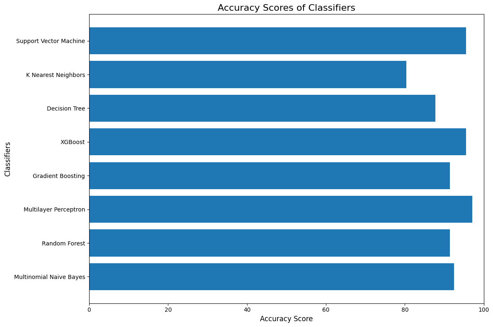

# Lenara Sitshayeva, Ph.D.
- Experienced IT professional with over 10 years of industry expertise, progressing from a database manager to a business analyst and eventually transitioning into data analytics. 
- Successfully served as a Business Intelligence Specialist and Data Engineer. 
- As Data Analyst in Descriptive and Predictive Analytics, consistently demonstrated a keen interest in Prescriptive Analytics and Optimisation. 
- Committed to continuous learning and skill development, actively seeking new knowledge and techniques. 
- Proficient in SQL, Python, Tableau, and Power BI, adept at extracting and analysing complex data sets, constructing data models, and generating valuable insights. 
- Dedicated to enhancing my skill set, with a recent focus on Data Science. 
- Currently seeking opportunities to apply my expertise, contribute to business growth, and make a positive impact in a supportive and challenging environment.

  <h1 style="color: #FFF;">CONTACTS</h1>

| [LinkedIn](https://www.linkedin.com/in/lenara-sitshayeva/) | [365 Data Science](learn.365financialanalyst.com/profile/lenara-sitshayeva-phd/) | [DataCamp](https://www.datacamp.com/profile/LenaraSitshayeva) |[Kaggle](https://www.kaggle.com/lenarasitshayeva) | [Credly](https://www.credly.com/users/lenara-sitshayeva) | [Medium](https://medium.com/@sitshayeva) | 
[Tableau](https://public.tableau.com/app/profile/lenara.sitshayeva) | [Google Colab](https://drive.google.com/drive/folders/1hDZrSDr9H5a28IoPMrSnel6Gb2EZWeSX?usp=share_link) | 
 
|[GitHub](https://github.com/sitshayeva) | [Dags Hub](https://dagshub.com/sitshayeva) | [Jovian](https://jovian.com/sitshayeva) | [Data World](https://data.world/lenara) | 
|[Codewars](https://www.codewars.com/users/sitshayeva) | [Bitbucket](https://bitbucket.org/lenara_sitshayeva) | [HackerRank](https://www.hackerrank.com/sitshayeva) | [AWS Certified Global Community](https://aws-certification.influitive.com/profiles/16874b24-62d0-4fbf-a9c8-c436a252cae0) | [Maven Analytics](https://mavenanalytics.io/profile/Lenara-Sitshayeva-Ph.D./96089275)|

  <h1 style="color: #FFF;"> DATA PROJECTS </h1>

## Sentiment Analysis of Yelp Business Reviews

[View Project's Files](https://github.com/sitshayeva/lenara.github.io/tree/main/projects/15)

## Using Streamlit for Data Visualisation

[View Project's Files](https://github.com/sitshayeva/lenara.github.io/tree/main/projects/18)

## WEB scrapping and Sentiment Analysis British Airways Customer Reviews

[View Project's Files](https://github.com/sitshayeva/lenara.github.io/tree/main/projects/24)

## Creating dynamic filters in Streamlit

[View Project's Files](https://github.com/sitshayeva/lenara.github.io/tree/main/projects/19)

## Predicting Customer Behaviour British Airways

[View Project's Files](https://github.com/sitshayeva/lenara.github.io/tree/main/projects/25)

## Machine Learning Analysis in Retail

[View Project's Files](https://github.com/sitshayeva/lenara.github.io/tree/main/projects/21)

## Credit Card Fraud Detection Scikit-Learn and Snap ML

[View Project's Files](https://github.com/sitshayeva/lenara.github.io/tree/main/projects/22)

## Natural Language Processing with Hugging Face Transformers

[View Project's Files](https://github.com/sitshayeva/lenara.github.io/tree/main/projects/23)

## Auto Exploratory Data Analysis D-Tale, SweetViz, Pandas Profiling

[View Project's Files](https://github.com/sitshayeva/lenara.github.io/tree/main/projects/26)

## Auto ML and Bespoke ML with sklearn (Random Forest, Logistic Regression, SVC)

[View Project's Files](https://github.com/sitshayeva/lenara.github.io/tree/main/projects/27)

## Assess the Quality of a Dataset for a Public Service Agency

[View Project's Files](https://github.com/sitshayeva/lenara.github.io/tree/main/projects/4)

## Correlation in Python
 
[View Project's Files](https://github.com/sitshayeva/lenara.github.io/tree/main/projects/20)

## Explore data by using SQL in Google Colab

[View Project's Files](https://github.com/sitshayeva/lenara.github.io/tree/main/projects/17)

## SQL sub-queries in Google Colab 

[View Project's Files](https://github.com/sitshayeva/lenara.github.io/tree/main/projects/16)

## Create a Dashboard Meeting Business Requirements

[View Project's Files](https://github.com/sitshayeva/lenara.github.io/tree/main/projects/6)

## Retrieve User Activity Data on an Online Forum Using SQL

[View Project's Files](https://github.com/sitshayeva/lenara.github.io/tree/main/projects/7)

## Working with Web APIs and JSON on Movies Dataset

[View Project's Files](https://github.com/sitshayeva/lenara.github.io/tree/main/projects/2)

## Explore a Dataset on Energy Usage and Draw First Conclusions

[View Project's Files](https://github.com/sitshayeva/lenara.github.io/tree/main/projects/5)

## Create a web server and an Amazon RDS DB instance

[View Project's Files](https://github.com/sitshayeva/lenara.github.io/tree/main/projects/3)

## Data Analysis using Pandas and SQLite3

[View Project's Files](https://github.com/sitshayeva/lenara.github.io/tree/main/projects/14)

## E-commerce Store Sales Analysis

[View Project's Files](https://github.com/sitshayeva/lenara.github.io/tree/main/projects/8)

## Exploratory Data Analysis on Diamonds Dataset

[View Project's Files](https://github.com/sitshayeva/lenara.github.io/tree/main/projects/9)

## Data Cleaning, Transformation and Visualisation on AirBnB London Dataset

[View Project's Files](https://github.com/sitshayeva/lenara.github.io/tree/main/projects/12)

## Data Cleaning on Movies Dataset

[View Project's Files](https://github.com/sitshayeva/lenara.github.io/tree/main/projects/10)

## Short-Term Rental Analytics on AirBnB Bristol Dataset

[View Project's Files](https://github.com/sitshayeva/lenara.github.io/tree/main/projects/11)

## Data Cleaning, Merging, Transforming on Movies Dataset

[View Project's Files](https://github.com/sitshayeva/lenara.github.io/tree/main/projects/13)

## Exploratory Data Analysis on Movies Dataset

[View Project's Files](https://github.com/sitshayeva/lenara.github.io/tree/main/projects/1)

--------------------------------------------------------------------------------------------------------------

  
  

